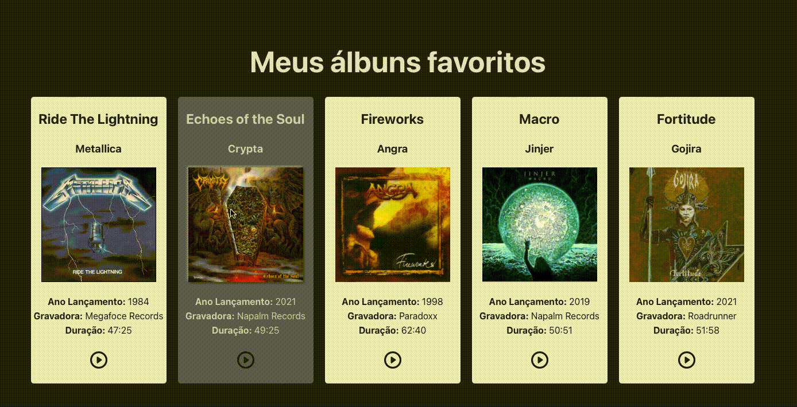

# Atividade Prática de Revisão

**Valor**: 7 pontos 
**Forma de Entrega**: Pull Request neste repositório 
**Modalidade:** Individual 
**Data limite de entrega:** 06/07/2023 até 11:30 🕥

🚨 **ATENÇÃO:** NÃO FAÇA A SUA ATIVIDADE NA BRANCH MAIN. CLONE ESTE REPOSITÓRIO, CRIE A SUA BRANCH E A PARTIR DELA FAÇA O SEU PROJETO. 
_Outra opção é realizar o seu projeto off-line e, ao terminar, criar a sua branch na página do GitHub. Ao acessar a sua branch, fazer o upload da pasta do seu projeto. Por fim, deve-se abrir o Pull Request!_

O objetivo é criar uma página web com React que exiba uma lista com seus álbuns favoritos. A página deverá ser parecida com a abaixo.

Explore a criatividade e vá além na estilização.
Para isso, instale a biblioteca **React** (com Vite e TypeScript) e realize o projeto. Atente-se aos passos. Não se esqueça de instalar as dependências **dentro da pasta do projeto** (`npm install`).

## Regras

- As imagens devem ser importadas. Não podem ser inseridas diretamente no JSX.
- Não é necessário criar componentes diferentes para cada álbum. Este processo será feito em uma outra atividade.
- Os álbuns deverão ficar lado a lado.
- O ícone _Play_ deve direcionar o usuário, ao ser clicado, para um link onde o álbum estará disponível (sugestão: YouTube).
- Ao passar o mouse em cada container, um estilo diferente deve aparecer.

### Observação importante

Antes de dar commits e realizar seu Pull Request, verifique se o arquivo `.gitignore` contém a informação `node_modules`. Essa pasta é muito volumosa e deve ser ignorada ao realizar o seu Pull Request.
